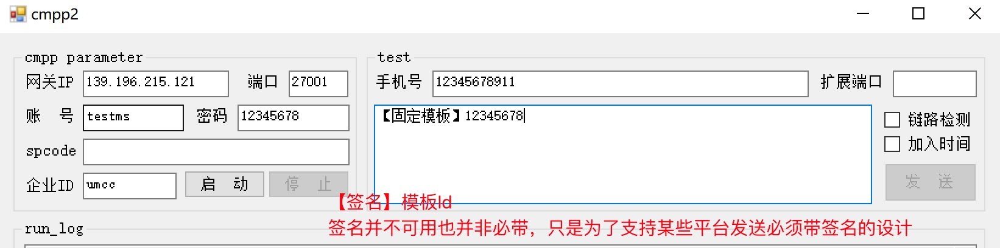
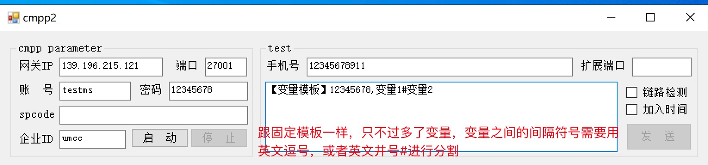

# 视频短信 CMPP . FAQ

* [CMPP错误码](static/cmpp_error_code.md)
> CMPP仅支持7个字节的错误码，由于视频短信错误码原因太长而做了缩减,所以返回并非标准CMPP错误码

## 短信发送

> CMPP 是中国移动文本短信发送的协议，使用在视频短信上并不完全适配
> 所以从发送内容上下手去做了改变，让已经有cmpp能力的客户快速对接进行发送

* 登录平台创建模板 -> `https://umyun.com`
* 等待模板通过进行发送
  * 固定模板发送格式(签名不起任何作用，因为有平台cmpp内容中必须加签名才能发送,所以进行了支持)
    * 模板Id
    * 【签名】模板Id
    * 
  * 变量模板发送格式(变量分隔符支持英文,(逗号) #(井号), 最多支持10个变量)
    * 模板Id,变量1,变量2
    * 模板Id#变量1#变量2
    * 【签名】模板Id,变量1,变量2
    * 【签名】模板Id#变量1#变量2
    * 